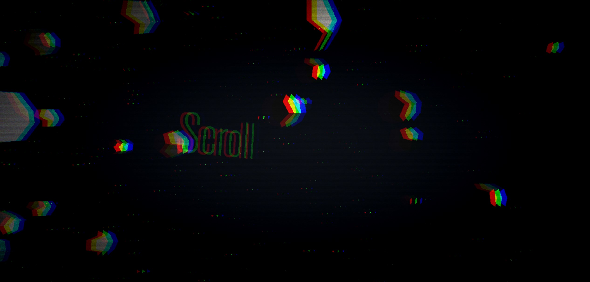

# Camera-path

This is an example on how moving an object along a path using Three.js.

## Description

Scroll down/up to translate the camera along the path

## Youtube video

Check the [video](https://youtu.be/gVy8Uxdw6g0) on youtube.

### THREE.js object animation on path

You can export point directly from the blender file in 'work' directory using script panel.